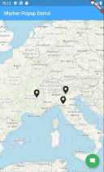

# `flutter_map_marker_popup`

Makes adding marker popups to `flutter_map` easy.

If you have any suggestions/problems please don't hesitate to open an issue.

## Getting Started

See the `example/` directory for a demo app which resulting in the following:

